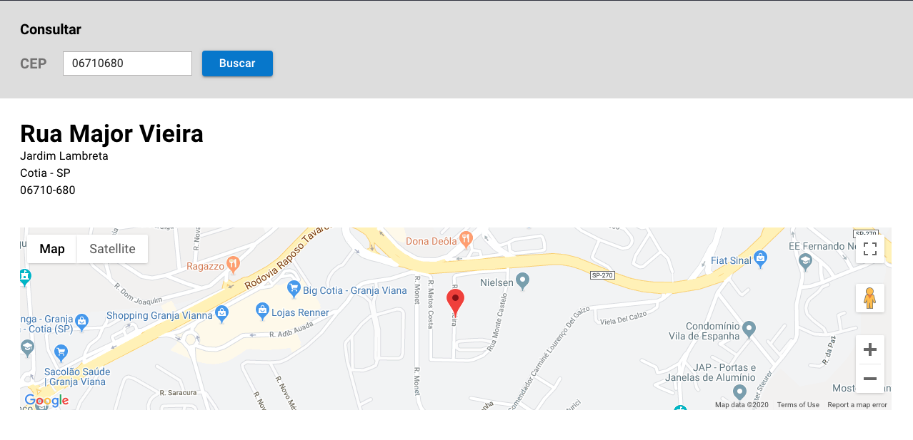

# Desafio Front End LuizaLabs (Magazine Luiza)
<p align="left">
  

  
  
  <a href="https://github.com/Relirk/luizalabs-challenge-cepMap-frontend/commits/master">
    
  </a>

  <a href="https://github.com/Relirk/luizalabs-challenge-cepMap-frontend/issues">
    
  </a>

  
</p>

Este repositório contém uma simples interface front-end para o desafio de front-end do LuizaLabs.
Todo layout da aplicação foi baseado em um escopo previamente obtido atravez do Luizalabs.



Tecnologias utilizadas:
* [ReactJS](https://reactjs.org/)
* [Material-UI](https://material-ui.com/)
* [Yarn](https://yarnpkg.com/)
* [Google Maps API](https://cloud.google.com/maps-platform/?hl=pt-br)
* [Viacep API](https://viacep.com.br/)

-- A estrutura escolhida para a escrita do código está feita por classes, focando na visualização dos components.

## Variáveis de ambiente
Crie um arquivo .env na raiz do seu projeto com as seguintes variáveis de ambiente:

```
REACT_APP_API_URL=https://viacep.com.br/ws/
REACT_APP_MAPS_API_URL=https://maps.googleapis.com/maps/api/geocode/
API_KEY=SUA_CHAVE_DE_API_PARA_O_GOOGLE_MAPS
```

## Como executar
- Faça o clone/download deste repositório;
- Execute `yarn install` e `yarn start`. A interface fica localizada em `http://localhost:3000`.

## Recursos
Esta interface tem implementado uma feature para consulta de endereco a partir do CEP.
